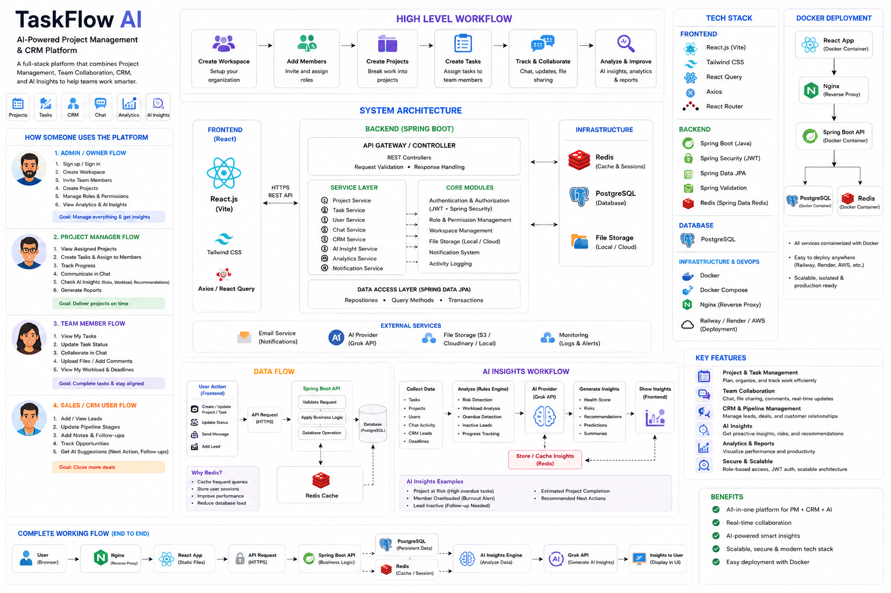

# TaskFlow AI

A full-stack enterprise platform that combines Project Management, Team Collaboration, CRM Pipeline, and AI-powered Insights into a single workspace. Built with React and Spring Boot.

---

## Architecture Overview



The diagram above covers the complete system: high-level workflow, system architecture layers, data flow, AI insights pipeline, user flows for each role, tech stack, and Docker deployment topology.

---

## What the Platform Does

Most teams use three or four separate tools — a task tracker, a CRM, a chat app, and some kind of analytics dashboard. TaskFlow AI replaces all of them with one workspace where everything is connected. A task assigned to a lead, a chat message mentioning a project, or a spike in overdue tasks all show up in the same place and influence the AI health score.

---

## Tech Stack

**Frontend**

- React 18 with Vite for fast development and builds
- Redux Toolkit for global state (auth, workspace, chat presence, notifications)
- TanStack Query for server state and caching
- Tailwind CSS with dark mode support
- Framer Motion for transitions and animations
- SockJS and STOMP for WebSocket connections
- dnd-kit for drag-and-drop on the Kanban board
- Recharts for analytics charts and graphs

**Backend**

- Spring Boot 3 running on Java 21
- Spring Security with stateless JWT authentication
- Spring Security OAuth2 Client for Google and GitHub login
- Spring Data JPA with Hibernate for all database access
- Spring WebSocket with STOMP in-memory broker for real-time messaging
- Spring Cache backed by Redis
- Spring Data Redis for presence tracking

**Infrastructure**

- PostgreSQL 15 for persistent data storage
- Redis 7 for presence heartbeats, session caching, and AI snapshot caching
- Docker and Docker Compose for local and production deployment
- Groq API (llama-3.3-70b-versatile) for all AI features

---

## System Architecture

The system is split into three layers.

The frontend is a React SPA that communicates with the backend over HTTPS for REST calls and over WebSocket for real-time events. All requests carry a JWT bearer token set by an Axios interceptor.

The backend has three internal layers: the API Gateway/Controller layer handles request validation and routing; the Service Layer contains all business logic (Project, Task, User, CRM, AI Insight, Notification, Activity services); the Data Access Layer uses Spring Data JPA repositories with query methods and transactions against PostgreSQL.

Infrastructure services sit alongside: Redis handles presence keys and caching, local file storage handles chat and task attachments, and the Groq API is called for AI responses.

---

## User Flows

**Admin / Owner**
Signs up, creates a workspace, invites team members with roles, creates projects, manages permissions, views analytics and AI insights across the entire workspace.

**Project Manager**
Views assigned projects, creates and assigns tasks to team members, tracks progress on the Kanban board, communicates in chat, checks AI workload recommendations, generates reports.

**Team Member**
Views their tasks, updates task status by dragging cards, collaborates in chat, uploads files, adds comments, monitors their workload and deadlines.

**Sales / CRM User**
Adds and updates leads, moves leads through pipeline stages, adds notes and follow-ups, tracks deal values and opportunities, uses AI suggestions for next actions and follow-up timing.

---

## Data Flow

1. A user action in the frontend (create task, send message, update lead) hits the backend as an HTTPS REST request.
2. Spring Security validates the JWT token and resolves the authenticated user.
3. The appropriate service applies business logic and runs the database operation via JPA.
4. For state changes that other users need to see immediately, the service publishes a message to the STOMP broker which broadcasts to all subscribers on the relevant topic.
5. Redis is used for two things: the Spring Cache layer caches expensive queries (AI insights, analytics), and the presence system tracks per-user heartbeat keys to maintain online status.

---

## AI Insights Workflow

The AI engine runs on real database data, not simulated values.

1. Collect: Tasks, projects, users, CRM leads, and deadlines are queried per workspace.
2. Analyze: The risk engine checks for overdue task count, workload distribution across members, lead inactivity (days since last follow-up), and stalled project detection.
3. Score: A health score from 0 to 100 is calculated by deducting points for each detected issue.
4. AI Provider: If a Groq API key is configured, the metrics are sent to llama-3.3-70b-versatile for natural language explanations and refined recommendations. If not available, a rule-based fallback produces the same structure.
5. Store: A daily snapshot is saved to the `ai_insight_snapshots` table for 7-day trend charts.
6. Display: The frontend renders the health score gauge, project risk cards, workload entries, CRM alerts, and actionable recommendation cards.

---

## Features

**Task Management**

Kanban board with drag-and-drop using dnd-kit. Tasks have five statuses (TODO, IN_PROGRESS, IN_REVIEW, DONE, CANCELLED) and four priority levels (LOW, MEDIUM, HIGH, URGENT). Each task supports comments, an activity log, file attachments, watchers, and an assignee. The AI can suggest priority and predict deadlines based on workload and task complexity.

**CRM Pipeline**

Lead management across six stages: LEAD, QUALIFIED, PROPOSAL, NEGOTIATION, WON, LOST. Each lead tracks deal value, assigned user, last activity timestamp, tags, and notes. Analytics show conversion rates, pipeline value by stage, and top performers by closed deals.

**Team Chat**

Private direct messages and group channels. Messages delivered in real-time via STOMP WebSocket. File sharing supports PDF, DOCX, XLSX, PPTX, and images up to 20 MB, stored in the container at `/tmp/uploads/chat/` and served through Spring's static resource handler. Presence tracking uses per-user Redis heartbeat keys with 60-second TTL refreshed every 30 seconds by the frontend. A full presence snapshot is broadcast to all connected clients on every new connection so there is no delay in seeing who is online. Additional moderation features: block a user (they cannot send private messages), remove a member from a group, or delete a chat room entirely.

**AI Insights Dashboard**

Per-workspace health score, project risk detection, team burnout alerts, CRM follow-up reminders, AI-generated recommendations with one-click actions (reassign task, create follow-up, open project), weekly executive summary, and 7-day trend charts.

**Analytics**

Task completion rates, status and priority distributions, team performance rankings by activity score, CRM deal funnel by value and count, activity heatmap for the last 35 days.

**Notifications**

Real-time delivery via a user-specific WebSocket queue (`/user/queue/notifications`). Created on: task assignment, comment posted, chat message, mention. Persistent in PostgreSQL with an unread badge in the sidebar.

**AI Copilot**

A floating chatbot available on every page. It receives the current page context (which feature the user is on, what data is visible) and uses Groq for context-aware responses. Maintains a conversation history per session. Includes quick commands for summarizing tasks, analyzing the CRM pipeline, and checking workload.

---

## Project Structure

```
TaskFlow-AI/
    crm-backend/
        src/main/java/com/arjun/crm/
            ai/                 AI controllers, services, Groq provider, response parser
            config/             Security, WebSocket, CORS, MVC, Redis, Jackson config
            controller/         REST controllers for all modules
            dto/                Request and response DTOs
            entity/             JPA entities (User, Task, Project, Lead, ChatMessage, etc.)
            enums/              TaskStatus, LeadStatus, MessageType, WorkspaceRole, etc.
            repository/         Spring Data JPA repositories with custom queries
            security/           JWT filter, JWT service, OAuth2 success handler
            service/            Business logic interfaces and implementations
        Dockerfile
        docker-compose.yml
        .env.example

    crm-frontend/
        src/
            components/         Reusable UI: Chat, Kanban, CRM, AI, common
            hooks/              useAuth, useChat, useStreamingText
            layouts/            DashboardLayout, AuthLayout
            pages/              Dashboard, Analytics, AIInsights, Chat, CRM, Kanban
            services/           Axios service files: api, chat, task, ai, crm, workspace
            store/              Redux slices: auth, workspace, chat, presence, notifications
        .env.example
```

---

## Getting Started

**Prerequisites**

- Docker Desktop installed and running
- Node.js 18 or later
- A Groq API key from console.groq.com (free tier is sufficient)
- Google OAuth credentials (optional, for Google login)
- GitHub OAuth credentials (optional, for GitHub login)

**Step 1: Clone**

```bash
git clone https://github.com/Arjunsingh-7/TaskFlow-AI.git
cd TaskFlow-AI
```

**Step 2: Configure the backend**

```bash
cd crm-backend
cp .env.example .env
```

Open `.env` and fill in the required values:

```
JWT_SECRET=any_random_string_at_least_32_characters_long
XAI_API_KEY=gsk_your_groq_api_key_here
DATABASE_PASSWORD=postgres
```

For OAuth2 login, also add your Google and GitHub client IDs and secrets.

**Step 3: Start the backend**

```bash
docker compose up -d --build
```

This starts PostgreSQL, Redis, and the Spring Boot application. Hibernate creates all database tables automatically on first run, including the `blocked_users`, `ai_insight_snapshots`, and `chat_messages` tables with attachment columns.

**Step 4: Start the frontend**

```bash
cd ../crm-frontend
cp .env.example .env
npm install
npm run dev
```

Open http://localhost:3000 in your browser.

**Step 5: Create an account**

Go to http://localhost:3000/register and sign up with an email and password, or use the Google or GitHub login buttons if OAuth2 is configured.

---

## Environment Variables

**Backend .env**

| Variable | Required | Description |
|---|---|---|
| JWT_SECRET | yes | Minimum 32 characters, any random string |
| XAI_API_KEY | yes | Groq API key |
| DATABASE_PASSWORD | yes | PostgreSQL password |
| GOOGLE_CLIENT_ID | optional | For Google OAuth login |
| GOOGLE_CLIENT_SECRET | optional | For Google OAuth login |
| GITHUB_CLIENT_ID | optional | For GitHub OAuth login |
| GITHUB_CLIENT_SECRET | optional | For GitHub OAuth login |
| UPLOAD_DIR | optional | Defaults to /tmp/uploads inside Docker |

**Frontend .env**

| Variable | Description |
|---|---|
| VITE_API_URL | Backend base URL. Defaults to Vite proxy to port 8080 |
| VITE_WS_URL | WebSocket URL. Defaults to http://localhost:8080/ws |

---

## Key API Endpoints

| Method | Path | Description |
|---|---|---|
| POST | /api/auth/login | Email and password login |
| POST | /api/auth/register | Register new account |
| GET | /api/workspaces | List workspaces for current user |
| POST | /api/tasks | Create a task |
| PATCH | /api/tasks/{id}/status | Update task status |
| GET | /api/tasks/project/{id} | Get tasks for a project |
| GET | /api/leads/workspace/{id}/analytics | CRM pipeline analytics |
| GET | /api/ai-insights/dashboard/{workspaceId} | AI workspace health and insights |
| POST | /api/chat/messages | Send a chat message |
| POST | /api/chat/messages/upload | Upload a file to a chat room |
| POST | /api/chat/rooms/block/{userId} | Block a user |
| DELETE | /api/chat/rooms/{id} | Delete a chat room |

---

## 5-Week Development Plan

**Week 1 — Core Infrastructure and Authentication**

Set up the project from scratch: Spring Boot with Maven, React with Vite, Docker Compose with PostgreSQL and Redis. Define the database schema for users, workspaces, projects, and tasks. Implement JWT-based authentication on the backend with a custom Spring Security filter chain set to stateless. On the frontend, build the Redux auth slice, configure the Axios interceptor to attach tokens, and create protected route guards. By end of week one the register, login, and logout flows work end to end.

**Week 2 — Task Management and Kanban Board**

Build the full task CRUD on the backend with workspace and project scoping. Create the Kanban board UI using dnd-kit for drag-and-drop. Implement the five task statuses and four priority levels. Add the task form with a date picker that serializes dates as yyyy-MM-dd to match Spring's LocalDate deserialization. Set up STOMP WebSocket on the backend and subscribe to project task topics on the frontend so moves appear in real time for all connected users. Add task comments, activity logs, and file attachments. Integrate Groq API for AI priority suggestions and deadline predictions.

**Week 3 — CRM Pipeline and Team Chat**

Build the lead entity with all pipeline stages and deal value tracking. Create the CRM board, filter panel, and analytics charts. Build the chat system: room creation, participant management, and real-time messaging over STOMP. Implement Redis-based presence tracking with per-user heartbeat keys. Add presence snapshot broadcasting on connect. Build file upload for chat attachments with type validation and 20 MB size limit. Add the block user, remove from group, and delete chat features with confirmation dialogs.

**Week 4 — AI Insights and Analytics**

Build the AI insights engine that queries real workspace data from the database. Implement the health score calculator with deductions for overdue tasks, stalled projects, inactive leads, and workload imbalance. Add project risk detection, team burnout analysis, and CRM follow-up alerts. Generate actionable recommendations with payloads for one-click actions. Save daily snapshots to the database for trend charts. Integrate Groq for natural language explanations with a rule-based fallback. Build the analytics dashboard with Recharts: completion rates, status distributions, team performance rankings, and the 35-day activity heatmap.

**Week 5 — OAuth2, Notifications, and Production Hardening**

Add Google and GitHub OAuth2 login using Spring Security OAuth2 Client. Implement dual security chains: one for OAuth2 PKCE redirects that needs a brief session, one stateless chain for all API routes. Fix session-related bugs: clear stale workspace state from localStorage on login and logout, proactive JWT expiry check in the Axios interceptor. Build the notification system with real-time WebSocket delivery and database persistence. Add the global AI Copilot with page context injection. Configure Dockerfile to pre-create upload directories with correct ownership for the non-root spring user. Create .env.example files and .gitignore rules to exclude all secrets before publishing to GitHub.

---

## Implementation Notes

**Why the backend is fully stateless**

Spring Security uses STATELESS session policy for all API and WebSocket routes. No cookies, no server-side sessions. The only exception is a separate Order(1) security filter chain covering /oauth2/** and /login/oauth2/** which needs a temporary session for the OAuth2 PKCE state parameter during the redirect handshake. After the token is generated and sent to the frontend, the session is invalidated immediately.

**How Redis presence works**

Each connected user gets their own Redis key `chat:online:user:{id}` with a 60-second TTL. The frontend publishes a heartbeat message to `/app/chat/heartbeat` every 30 seconds to refresh it. Spring listens to `SessionConnectEvent` and `SessionDisconnectEvent` to mark users online and offline automatically, even when a browser tab is closed without an explicit disconnect message. On every connect, a full snapshot of all online user IDs is broadcast to `/topic/presence/snapshot` so newly joined users immediately see the correct presence state.

**Why dates are formatted before sending**

Spring's LocalDate cannot deserialize a JavaScript ISO datetime string like `2026-06-15T18:30:00.000Z`. Jackson expects `2026-06-15`. The frontend converts all JavaScript Date objects from the date picker into yyyy-MM-dd strings before sending them in the request body.

**Why Docker uploads go to /tmp**

The Docker container runs as a non-root `spring` user for security. The /app directory is not writable by that user. Files are uploaded to `/tmp/uploads` which is created with `chown spring:spring` in the Dockerfile before the USER directive. No named volume is mounted over that path, which would reset ownership to root.

**Lombok annotation processing**

The pom.xml explicitly declares Lombok in the maven-compiler-plugin annotationProcessorPaths. Without this, the Maven compiler sometimes fails to process @Builder, @Slf4j and other annotations during a clean no-cache build, producing "cannot find symbol" errors on generated methods like builder() and log.

---

## License

MIT

---

Built by [Arjun Singh](https://github.com/Arjunsingh-7)
